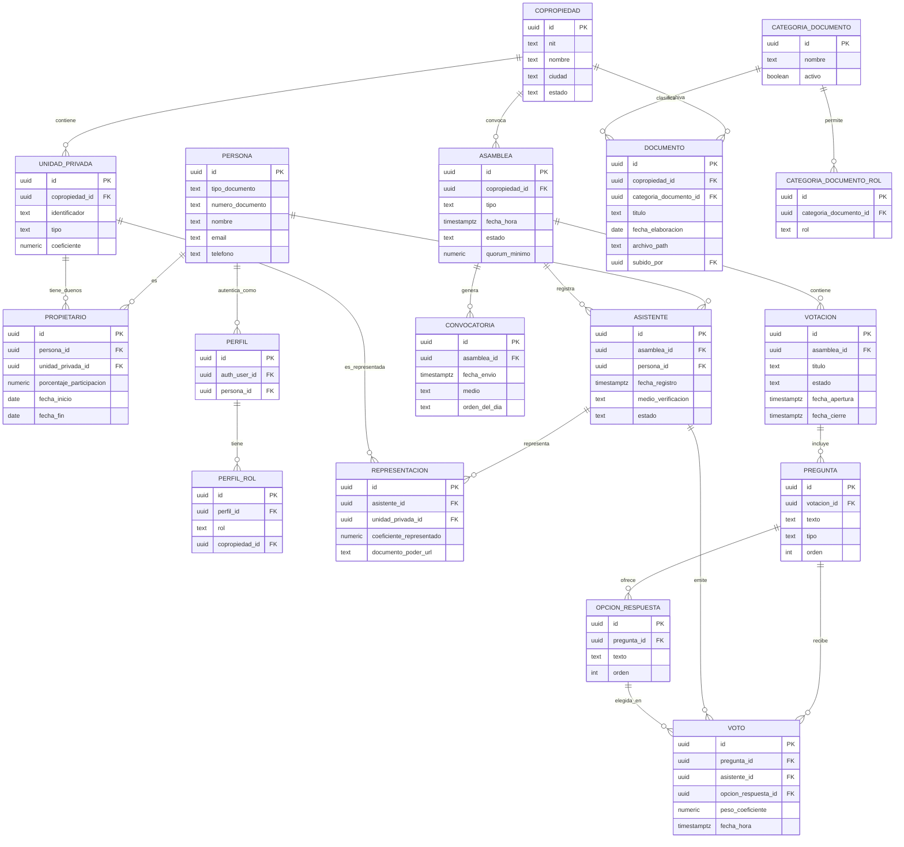

# Modelo de datos

## Principios de modelado

1. **Multi-tenant por columna, no por base de datos.** Toda tabla que
   pertenece a una copropiedad tiene `copropiedad_id`. Nunca se crea una base
   de datos ni un esquema por copropiedad (no escala operacionalmente a
   miles).
2. **Normalización estándar (3FN)** para las entidades maestras
   (copropiedades, personas, unidades). Se acepta desnormalización puntual
   solo donde el tiempo real lo exige (ver "peso del voto" más abajo), y
   siempre documentada.
3. **Todo `many-to-many` se modela con tabla intermedia explícita** (nunca
   arrays/JSON para relaciones que necesitan integridad referencial,
   auditoría o consultas eficientes).
4. **Fechas de vigencia (`fecha_inicio`/`fecha_fin`)** en las relaciones que
   cambian con el tiempo (propietario de una unidad, representación en una
   asamblea) en vez de borrar filas — así se conserva historial para
   auditoría legal.
5. **Snapshots donde la ley exige trazabilidad.** El peso de un voto se
   guarda como valor fijo en el momento de votar, no se recalcula después
   aunque el coeficiente de la unidad cambie más adelante.

## Entidades principales

### Copropiedad
La unidad de negocio (tenant). `nit`, `nombre`, `direccion`, `ciudad`,
`fecha_registro`, `estado` (activa/inactiva).

### UnidadPrivada
Una unidad dentro de una copropiedad (apartamento, parqueadero, depósito,
local). `copropiedad_id`, `identificador` (ej. "Apto 501"), `tipo`,
`coeficiente` (decimal, participación sobre el total — la suma de todos los
coeficientes de una copropiedad debe ser 1.0 / 100%, según Ley 675 art. 3).

### Persona
Cualquier individuo que el sistema conoce: propietario, apoderado, personal
administrativo. `tipo_documento`, `numero_documento` (único junto con
`tipo_documento`), `nombre`, `email`, `telefono`.

### Propietario (tabla intermedia Persona ↔ UnidadPrivada)
Relación muchos-a-muchos: una unidad puede tener varios copropietarios, y una
persona puede ser propietaria de varias unidades (incluso en distintas
copropiedades). `persona_id`, `unidad_privada_id`, `porcentaje_participacion`
(cuando la unidad tiene más de un dueño), `fecha_inicio`, `fecha_fin`
(nullable — nulo significa vigente).

### Perfil (usuario del sistema)
Vincula un usuario autenticado (Supabase Auth) con una `Persona`, 1:1.
`auth_user_id` (FK a `auth.users` de Supabase, único), `persona_id`.

### PerfilRol (roles de un perfil — multi-rol)
Un perfil puede tener **varios roles a la vez** (ej. `site_owner` y
`super_admin` simultáneamente, o `propietario` y `consejero` en la misma
copropiedad) — por eso los roles viven en una tabla aparte, no en una
columna de `perfil`. `perfil_id`, `rol`, `copropiedad_id` (nullable — nula
para roles globales `super_admin`/`site_owner`, poblada para roles scoped
`admin_copropiedad`/`consejero`/`propietario`, agregada en Fase 2.2.1).
Detalle completo en
[03-autenticacion-autorizacion.md](03-autenticacion-autorizacion.md).

> **Nota de alcance (actualizada en Fase 2.2.1):** la columna
> `copropiedad_id` en `perfil_rol` y los roles `admin_copropiedad`/
> `consejero`/`propietario` se agregan cuando se construye el portal de
> clientes (ver [07-roadmap-fases.md](07-roadmap-fases.md), Fase 2.2). La
> asignación de `propietario` es automática al autoregistrarse (Fase
> 2.2.2), nunca manual como default.

### CategoriaDocumento (catálogo de categorías, Fase 2.1)
Catálogo **global**, compartido por todas las copropiedades (no lleva
`copropiedad_id`) — editable por `super_admin` sin necesitar un deploy.
`nombre`, `activo`. Categorías iniciales: `comunicado`, `acta_asamblea`,
`acta_consejo`, `general` (reglamentos, manuales, informes de gestión).

### CategoriaDocumentoRol (tabla intermedia CategoriaDocumento ↔ rol)
Many-to-many: qué rol(es) pueden ver cada categoría. `categoria_documento_id`,
`rol` (texto: `admin_copropiedad`/`consejero`/`propietario`). `super_admin`
ve todas las categorías siempre, sin necesitar fila aquí.

### Documento (Fase 2.1)
`copropiedad_id`, `categoria_documento_id`, `titulo`, `fecha_elaboracion`,
`archivo_path` (ruta dentro de un bucket privado de Supabase Storage,
acceso vía URLs firmadas de corta duración — nunca públicas), `subido_por`
(FK a `perfil`). Sin versionado: reemplazar un documento sobrescribe
`archivo_path`/`fecha_elaboracion` en la misma fila.

### Asamblea
`copropiedad_id`, `tipo` (ordinaria/extraordinaria), `fecha_hora`, `estado`
(convocada / en_curso / cerrada), `quorum_minimo` (fracción requerida, ej.
0.51 por defecto — configurable porque los reglamentos internos pueden
exigir más).

### Convocatoria
`asamblea_id`, `fecha_envio`, `medio` (email; SMS/WhatsApp quedan para
cuando exista el módulo de mensajería), `orden_del_dia` (texto o tabla
`ConvocatoriaItem` si se necesita estructura).

### Asistente
Un check-in de una `Persona` en una `Asamblea` específica — es la entidad
clave para el cálculo de quórum y para votar. `asamblea_id`, `persona_id`,
`fecha_registro`, `medio_verificacion` (email/sms), `estado`
(registrado/retirado).

### Representacion (Poder) — tabla intermedia Asistente ↔ UnidadPrivada
Un asistente puede representar varias unidades (las propias más las que
recibe por poder). `asistente_id`, `unidad_privada_id`,
`coeficiente_representado` (snapshot del coeficiente de la unidad al momento
del registro), `documento_poder_url` (nullable — soporte legal del poder,
cuando aplique), `fecha_registro`.

### Votacion
`asamblea_id`, `titulo`, `estado` (abierta/cerrada), `fecha_apertura`,
`fecha_cierre`.

### Pregunta
`votacion_id`, `texto`, `tipo` (`si_no` | `seleccion_unica` |
`opcion_multiple`), `orden`.

### OpcionRespuesta
`pregunta_id`, `texto`, `orden`. Para `si_no` se generan automáticamente dos
opciones ("Sí"/"No") para mantener el mismo modelo en todos los tipos.

### Voto
`pregunta_id`, `asistente_id`, `opcion_respuesta_id`,
**`peso_coeficiente`** (snapshot: suma de los `coeficiente_representado` del
asistente al momento de votar — no se recalcula si después cambian los
poderes), `fecha_hora`.
**Restricción única:** `UNIQUE(pregunta_id, asistente_id)` — garantiza a
nivel de base de datos que nadie vote dos veces en la misma pregunta, sin
depender de que el frontend se comporte bien.

### AuditLog (bitácora)
`tabla`, `registro_id`, `accion` (insert/update/delete), `usuario_id`,
`valores_antes` (jsonb), `valores_despues` (jsonb), `fecha_hora`. Se llena
mediante triggers de Postgres en las tablas sensibles (Asamblea, Votacion,
Voto, Propietario, Representacion), no desde código de aplicación — así
ningún camino de escritura se puede saltar la auditoría.

## Diagrama entidad-relación



## Cálculo de quórum y resultados (vistas, no lógica de aplicación)

El quórum y los resultados de una votación se calculan con **vistas SQL**
(o funciones), nunca sumando en memoria desde el backend — así el número
mostrado es siempre consistente con lo que hay realmente en la base de
datos, incluso con múltiples votos llegando al mismo tiempo:

```sql
-- Quórum representado en una asamblea, en tiempo real
create view quorum_asamblea as
select
  a.id as asamblea_id,
  coalesce(sum(r.coeficiente_representado), 0) as coeficiente_representado,
  (select sum(u.coeficiente) from unidad_privada u where u.copropiedad_id = a.copropiedad_id) as coeficiente_total
from asamblea a
left join asistente asi on asi.asamblea_id = a.id and asi.estado = 'registrado'
left join representacion r on r.asistente_id = asi.id
group by a.id;
```

Supabase Realtime escucha cambios en `asistente` y `representacion` para
refrescar esta vista en el frontend sin recargar la página (detalle completo
en [04-api-y-tiempo-real.md](04-api-y-tiempo-real.md)).

## Restricciones e índices clave

- `UNIQUE(pregunta_id, asistente_id)` en `voto` — un asistente, un voto por
  pregunta.
- `UNIQUE(persona_id, unidad_privada_id, fecha_inicio)` en `propietario` —
  evita duplicar el mismo período de propiedad.
- `UNIQUE(asistente_id, unidad_privada_id)` en `representacion` — una unidad
  no puede ser representada dos veces por el mismo asistente.
- `CHECK` en `unidad_privada.coeficiente` y `representacion.coeficiente_representado`
  para que sean `>= 0`.
- Índice compuesto `(copropiedad_id, ...)` en toda tabla tenant-scoped — es
  la columna por la que filtra RLS en cada consulta, así que debe estar
  indexada siempre.
- Índice en `voto(pregunta_id)` y `asistente(asamblea_id)` — son las
  consultas más frecuentes durante una votación en vivo.
- `UNIQUE(categoria_documento_id, rol)` en `categoria_documento_rol` — no
  tiene sentido marcar el mismo rol dos veces para la misma categoría.
- Índice en `documento(copropiedad_id, categoria_documento_id)` — es lo
  que filtra la política RLS de lectura en cada consulta del portal.

## Pendiente de validar con el negocio antes de implementar

- ¿Una copropiedad puede tener más de un `quorum_minimo` según el tipo de
  decisión (ordinaria vs. reforma de reglamento, que en la Ley 675 exige
  mayorías calificadas distintas)? Si es así, `Votacion` necesita su propio
  `mayoria_requerida` en vez de heredar solo el de `Asamblea`.
- ¿Los poderes (`documento_poder_url`) requieren aprobación de un admin antes
  de contar en el quórum, o se aceptan al momento del registro? Afecta si
  `Representacion` necesita un campo `estado` (pendiente/aprobado).
