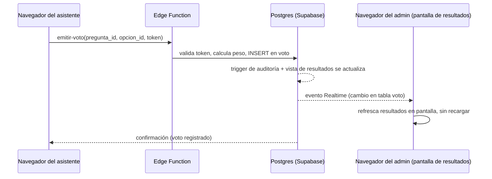

# Diseño de API y estrategia de tiempo real

## De dónde sale "la API"

No hay un servidor propio corriendo un framework tipo Express/NestJS. La
superficie de API se compone de **dos piezas complementarias**:

1. **API auto-generada de Supabase (PostgREST) + RLS** — para el 80% de las
   operaciones CRUD (leer copropiedades, unidades, asambleas, registrar un
   asistente, leer resultados). El navegador llama directo con el cliente JS
   de Supabase; la "validación" y "autorización" las hace RLS, no un
   controlador escrito a mano.
2. **Supabase Edge Functions** — para todo lo que necesita un secreto o una
   transacción con lógica de negocio no trivial: enviar el OTP por SMS/email,
   emitir el token firmado del asistente, cerrar una votación y calcular
   resultados finales de forma atómica, futuras integraciones (DIAN,
   WhatsApp).

Esto **sí es una API REST real y versionada** — las Edge Functions se
publican bajo una ruta versionada (`/functions/v1/...`) y siguen las mismas
reglas de cualquier API pensada para durar: DTOs explícitos, validación de
entrada, códigos de error consistentes, paginación donde aplica.

## Convenciones de la API (Edge Functions)

- **Versionado:** prefijo `v1` en la ruta de cada función
  (`votaciones-emitir-voto-v1`, o bien organizadas bajo
  `/functions/v1/votaciones/emitir-voto`). Un cambio incompatible crea `v2` en
  vez de romper `v1` — los clientes existentes (web, futura app móvil) no se
  rompen con un despliegue.
- **DTOs:** cada función define su tipo de entrada y salida con Zod (validación
  + inferencia de tipos TypeScript desde el mismo esquema, una sola fuente de
  verdad).
- **Errores:** formato consistente en toda la API:
  ```json
  { "error": { "codigo": "ASAMBLEA_CERRADA", "mensaje": "La asamblea ya finalizó." } }
  ```
  Nunca se devuelve un stack trace ni un mensaje de Postgres crudo al
  cliente.
- **Paginación:** listados (ej. unidades de una copropiedad, historial de
  asambleas) usan `?page=&pageSize=` con un máximo de `pageSize` fijo en el
  servidor, para evitar que un cliente pida "todo" y sature la función.
- **Idempotencia:** las funciones que causan efectos (emitir voto, registrar
  asistente) son seguras de reintentar — si la red falla y el cliente
  reintenta, la restricción única en base de datos (`UNIQUE(pregunta_id,
  asistente_id)`) hace que un segundo intento devuelva "ya registrado" en vez
  de un voto duplicado.

## Catálogo inicial de Edge Functions (fase Asambleas/Votaciones)

| Función | Qué hace |
|---|---|
| `auth-asistente-solicitar-otp` | Recibe email/teléfono + `asamblea_id`, envía el código de un solo uso |
| `auth-asistente-verificar-otp` | Valida el código, emite el JWT de alcance limitado (`asistente_id` + `asamblea_id`) |
| `asamblea-abrir` | Cambia `estado` de la asamblea a `en_curso`, dispara el cálculo inicial de quórum |
| `asamblea-cerrar` | Cambia `estado` a `cerrada`, congela el quórum final |
| `votacion-abrir` / `votacion-cerrar` | Controla el ciclo de vida de cada pregunta/votación dentro de la asamblea |
| `votaciones-emitir-voto` | Valida el token del asistente, calcula `peso_coeficiente` (snapshot), inserta el voto respetando la restricción única |

## Tiempo real: cómo se actualizan quórum y resultados

**No hay un servidor de sockets propio.** El navegador se suscribe
directamente al canal de Realtime de Supabase, que emite eventos cuando
cambian las tablas relevantes:



- Al abrir `/votaciones`, el navegador del asistente y la pantalla del admin
  se suscriben (vía cliente Supabase) a cambios en `asistente`,
  `representacion` y `voto` filtrados por `asamblea_id`.
- Cada `INSERT` dispara el evento; el frontend vuelve a consultar la vista
  `quorum_asamblea` (o la vista de resultados por pregunta) y actualiza la
  UI — la fuente de verdad sigue siendo la base de datos, el frontend nunca
  "suma" votos en memoria.
- Esto escala razonablemente para "cientos de asistentes conectados
  simultáneamente" porque Supabase Realtime maneja la multiplexación de
  conexiones — GoDaddy nunca ve estas conexiones, todas van directo al
  servicio de Supabase.

## Qué pasa si el volumen crece mucho más (miles de asistentes, no cientos)

Fuera de alcance para las fases actuales, pero documentado para no
sorprender a futuro: si un solo evento de votación necesitara escalar a
miles de conexiones concurrentes, la evolución natural sería introducir una
capa de caché/agregación (ej. Redis) para los contadores de quórum "calientes"
en vez de recalcular la vista SQL en cada evento. Esto se evalúa solo si el
uso real lo exige — hoy sería complejidad prematura.
